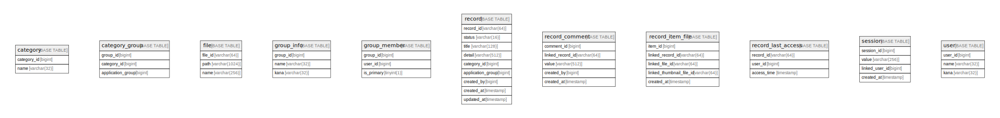

# app

## Tables

| Name | Columns | Comment | Type |
| ---- | ------- | ------- | ---- |
| [category](category.md) | 2 |  | BASE TABLE |
| [category_group](category_group.md) | 3 |  | BASE TABLE |
| [file](file.md) | 3 |  | BASE TABLE |
| [group_info](group_info.md) | 3 |  | BASE TABLE |
| [group_member](group_member.md) | 3 |  | BASE TABLE |
| [record](record.md) | 9 |  | BASE TABLE |
| [record_comment](record_comment.md) | 5 |  | BASE TABLE |
| [record_item_file](record_item_file.md) | 5 |  | BASE TABLE |
| [record_last_access](record_last_access.md) | 3 |  | BASE TABLE |
| [session](session.md) | 4 |  | BASE TABLE |
| [user](user.md) | 3 |  | BASE TABLE |

## Relations

---

> Generated by [tbls](https://github.com/k1LoW/tbls)
