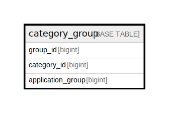

# category_group

## Description

<details>
<summary><strong>Table Definition</strong></summary>

```sql
CREATE TABLE `category_group` (
  `group_id` bigint NOT NULL,
  `category_id` bigint NOT NULL,
  `application_group` bigint NOT NULL,
  PRIMARY KEY (`group_id`,`category_id`,`application_group`)
) ENGINE=InnoDB DEFAULT CHARSET=utf8mb4 COLLATE=utf8mb4_0900_ai_ci
```

</details>

## Columns

| Name | Type | Default | Nullable | Children | Parents | Comment |
| ---- | ---- | ------- | -------- | -------- | ------- | ------- |
| group_id | bigint |  | false |  |  |  |
| category_id | bigint |  | false |  |  |  |
| application_group | bigint |  | false |  |  |  |

## Constraints

| Name | Type | Definition |
| ---- | ---- | ---------- |
| PRIMARY | PRIMARY KEY | PRIMARY KEY (group_id, category_id, application_group) |

## Indexes

| Name | Definition |
| ---- | ---------- |
| PRIMARY | PRIMARY KEY (group_id, category_id, application_group) USING BTREE |

## Relations



---

> Generated by [tbls](https://github.com/k1LoW/tbls)
