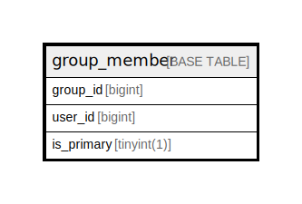

# group_member

## Description

<details>
<summary><strong>Table Definition</strong></summary>

```sql
CREATE TABLE `group_member` (
  `group_id` bigint NOT NULL,
  `user_id` bigint NOT NULL,
  `is_primary` tinyint(1) NOT NULL DEFAULT '1',
  PRIMARY KEY (`group_id`,`user_id`)
) ENGINE=InnoDB DEFAULT CHARSET=utf8mb4 COLLATE=utf8mb4_0900_ai_ci
```

</details>

## Columns

| Name | Type | Default | Nullable | Children | Parents | Comment |
| ---- | ---- | ------- | -------- | -------- | ------- | ------- |
| group_id | bigint |  | false |  |  |  |
| user_id | bigint |  | false |  |  |  |
| is_primary | tinyint(1) | 1 | false |  |  |  |

## Constraints

| Name | Type | Definition |
| ---- | ---- | ---------- |
| PRIMARY | PRIMARY KEY | PRIMARY KEY (group_id, user_id) |

## Indexes

| Name | Definition |
| ---- | ---------- |
| PRIMARY | PRIMARY KEY (group_id, user_id) USING BTREE |

## Relations



---

> Generated by [tbls](https://github.com/k1LoW/tbls)
