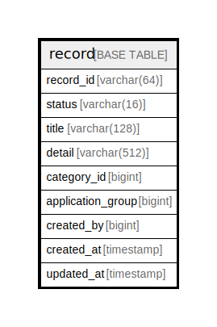

# record

## Description

<details>
<summary><strong>Table Definition</strong></summary>

```sql
CREATE TABLE `record` (
  `record_id` varchar(64) NOT NULL,
  `status` varchar(16) NOT NULL,
  `title` varchar(128) NOT NULL,
  `detail` varchar(512) NOT NULL,
  `category_id` bigint NOT NULL,
  `application_group` bigint NOT NULL,
  `created_by` bigint NOT NULL,
  `created_at` timestamp NOT NULL,
  `updated_at` timestamp NOT NULL,
  PRIMARY KEY (`record_id`)
) ENGINE=InnoDB DEFAULT CHARSET=utf8mb4 COLLATE=utf8mb4_0900_ai_ci
```

</details>

## Columns

| Name | Type | Default | Nullable | Children | Parents | Comment |
| ---- | ---- | ------- | -------- | -------- | ------- | ------- |
| record_id | varchar(64) |  | false |  |  |  |
| status | varchar(16) |  | false |  |  |  |
| title | varchar(128) |  | false |  |  |  |
| detail | varchar(512) |  | false |  |  |  |
| category_id | bigint |  | false |  |  |  |
| application_group | bigint |  | false |  |  |  |
| created_by | bigint |  | false |  |  |  |
| created_at | timestamp |  | false |  |  |  |
| updated_at | timestamp |  | false |  |  |  |

## Constraints

| Name | Type | Definition |
| ---- | ---- | ---------- |
| PRIMARY | PRIMARY KEY | PRIMARY KEY (record_id) |

## Indexes

| Name | Definition |
| ---- | ---------- |
| PRIMARY | PRIMARY KEY (record_id) USING BTREE |

## Relations



---

> Generated by [tbls](https://github.com/k1LoW/tbls)
