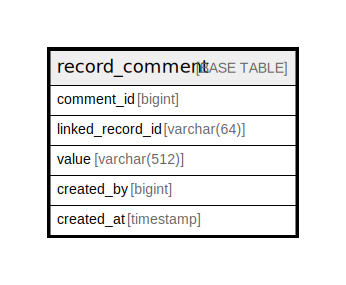

# record_comment

## Description

<details>
<summary><strong>Table Definition</strong></summary>

```sql
CREATE TABLE `record_comment` (
  `comment_id` bigint NOT NULL AUTO_INCREMENT,
  `linked_record_id` varchar(64) NOT NULL,
  `value` varchar(512) NOT NULL,
  `created_by` bigint NOT NULL,
  `created_at` timestamp NOT NULL,
  PRIMARY KEY (`comment_id`)
) ENGINE=InnoDB DEFAULT CHARSET=utf8mb4 COLLATE=utf8mb4_0900_ai_ci
```

</details>

## Columns

| Name | Type | Default | Nullable | Extra Definition | Children | Parents | Comment |
| ---- | ---- | ------- | -------- | ---------------- | -------- | ------- | ------- |
| comment_id | bigint |  | false | auto_increment |  |  |  |
| linked_record_id | varchar(64) |  | false |  |  |  |  |
| value | varchar(512) |  | false |  |  |  |  |
| created_by | bigint |  | false |  |  |  |  |
| created_at | timestamp |  | false |  |  |  |  |

## Constraints

| Name | Type | Definition |
| ---- | ---- | ---------- |
| PRIMARY | PRIMARY KEY | PRIMARY KEY (comment_id) |

## Indexes

| Name | Definition |
| ---- | ---------- |
| PRIMARY | PRIMARY KEY (comment_id) USING BTREE |

## Relations



---

> Generated by [tbls](https://github.com/k1LoW/tbls)
