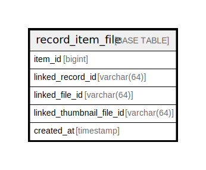

# record_item_file

## Description

<details>
<summary><strong>Table Definition</strong></summary>

```sql
CREATE TABLE `record_item_file` (
  `item_id` bigint NOT NULL AUTO_INCREMENT,
  `linked_record_id` varchar(64) NOT NULL,
  `linked_file_id` varchar(64) NOT NULL,
  `linked_thumbnail_file_id` varchar(64) NOT NULL,
  `created_at` timestamp NOT NULL,
  PRIMARY KEY (`item_id`)
) ENGINE=InnoDB DEFAULT CHARSET=utf8mb4 COLLATE=utf8mb4_0900_ai_ci
```

</details>

## Columns

| Name | Type | Default | Nullable | Extra Definition | Children | Parents | Comment |
| ---- | ---- | ------- | -------- | ---------------- | -------- | ------- | ------- |
| item_id | bigint |  | false | auto_increment |  |  |  |
| linked_record_id | varchar(64) |  | false |  |  |  |  |
| linked_file_id | varchar(64) |  | false |  |  |  |  |
| linked_thumbnail_file_id | varchar(64) |  | false |  |  |  |  |
| created_at | timestamp |  | false |  |  |  |  |

## Constraints

| Name | Type | Definition |
| ---- | ---- | ---------- |
| PRIMARY | PRIMARY KEY | PRIMARY KEY (item_id) |

## Indexes

| Name | Definition |
| ---- | ---------- |
| PRIMARY | PRIMARY KEY (item_id) USING BTREE |

## Relations



---

> Generated by [tbls](https://github.com/k1LoW/tbls)
